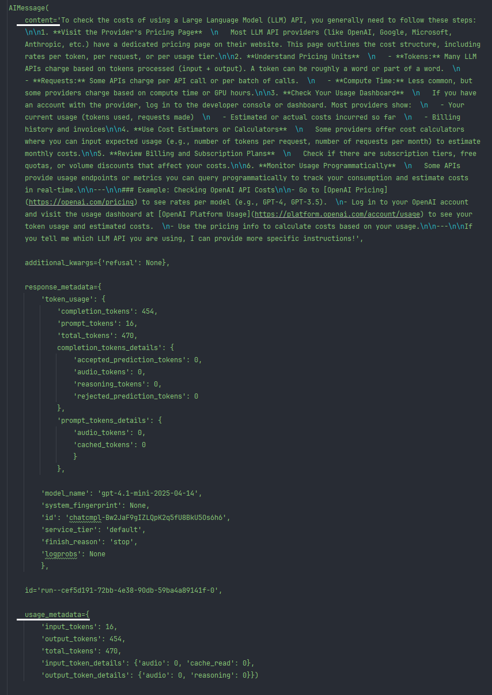
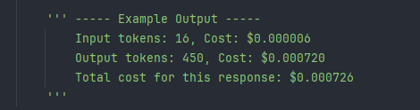

# How to check LLM api costs

This project demonstrates how to programmatically check and calculate the costs associated with using Large Language Model (LLM) APIs, specifically OpenAI's GPT-4.1 family, by tracking the number of tokens sent and received and applying the correct pricing.

## Overview

When using LLM APIs, costs are typically based on the number of tokens processed (both input and output). This repository provides a simple Python example that:

- Sends a prompt to an OpenAI LLM (e.g., GPT-4.1-mini)
- Receives the model’s response
- Extracts token usage statistics from the API response
- Calculates the cost of the API call using up-to-date pricing
- Prints a detailed breakdown of input/output tokens and their respective costs

## Project Structure

```
how_to_check_llm_api_costs/
│
├── src/
│   ├── main.py                # Main script: sends a prompt, gets a response, calculates and prints costs
│   ├── main.bat               # Batch file to run the main script (Windows)
│   └── common/
│       └── file_handler.py    # Utility for handling file paths/current working directory
│
├── requirements.txt           # Python dependencies (langchain, langchain_openai, python-dotenv, etc.)
├── README.md                  # Project documentation
├── LICENSE                    # License file
├── _conda_create_env.bat      # Batch script to create a conda environment
├── _conda_env_name.ini        # Conda environment name configuration
├── _conda_install_requirements.bat # Batch script to install requirements in conda
```

## How It Works

1. **Environment Setup**: Loads your OpenAI API key from a `.env` file.
2. **Prompt Submission**: Sends a user-defined question to the selected OpenAI model.
3. **Response Handling**: Receives the AI’s answer and extracts token usage statistics.
4. **Cost Calculation**: Uses a built-in price table to compute the cost for input and output tokens.
5. **Output**: Prints the AI’s response and a detailed cost breakdown.

## Visual Guide

### 1. Structure of AIMessage Output



*The image above shows the structure of the AIMessage object returned by the LLM API. The most important fields for cost calculation are:*
- **content** – the actual text response from the model
- **usage_metadata** – contains the number of input and output tokens, which are needed to calculate the cost*

### 2. Example Output of API Call Cost Calculation



*This image shows a sample output from the program, where the cost for a specific prompt is calculated (the sum of input and output token costs according to the current model pricing).* 

## Example Output

```
Input tokens: 16, Cost: $0.000006
Output tokens: 450, Cost: $0.000720
Total cost for this response: $0.000726
```

## Getting Started

### 1. Clone the Repository

```bash
git clone https://github.com/yourusername/how_to_check_llm_api_costs.git
cd how_to_check_llm_api_costs
```

### 2. Set Up Environment

- Create a `.env` file in the project root with your OpenAI API key:

  ```
  OPENAI_API_KEY=your_openai_api_key_here
  ```

- (Optional) Use the provided conda scripts to set up your environment:

  ```bash
  ./_conda_create_env.bat
  ./_conda_install_requirements.bat
  ```

- Or install dependencies directly:

  ```bash
  pip install -r requirements.txt
  ```

### 3. Run the Demo

```bash
python src/main.bat
```

## Customization

- Change the prompt or model in `src/main.py` as needed.
- Update the `model_prices` dictionary if OpenAI pricing changes.

## License

This project is licensed under the MIT License.
